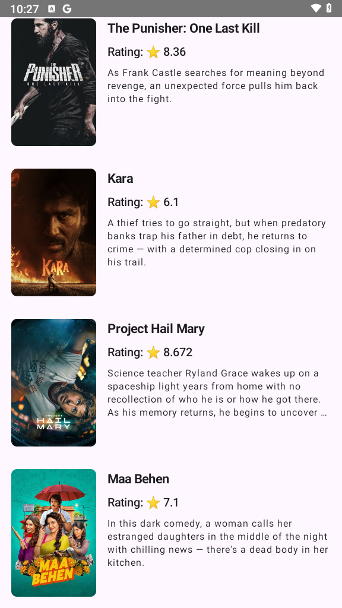

# Android Clean Architecture Showcase 🎬

A modern Android application demonstrating **Clean Architecture**, **MVVM**, and industry-standard best practices using **Jetpack Compose** and **Kotlin 2.x**.

## 📱 App Screenshot

<p align="center">
  
</p>

---

## 🏗️ Architecture & Layering Strategy
The project is strictly separated into three core layers to enforce the separation of concerns and testability:

### 1. Domain Layer (Core Business Logic)
- **Entities:** Pure Kotlin data classes (`Movie`) representing the core business models, completely independent of database or network frameworks.
- **Use Cases:** Encapsulates single, specific business tasks (`GetPopularMoviesUseCase`). Implements Kotlin `Flow` to stream execution states (`Loading`, `Success`, `Error`).
- **Repository Interfaces:** Defines the contract for data operations, ensuring the domain layer remains decoupled from data sources.

### 2. Data Layer (Data Management)
- **API Service:** Handles remote network requests using **Retrofit** to fetch raw data from TMDB.
- **Data Transfer Objects (DTOs):** Represents API response structures (`MovieDto`), preventing API changes from breaking the application's core logic.
- **Mappers:** Functions that transform DTOs into pure Domain models.
- **Repository Implementation:** Implements the domain repository interfaces, coordinating network requests and exception handling.

### 3. Presentation Layer (UI & State)
- **UI Framework:** 100% Declarative UI built with **Jetpack Compose**.
- **State Management:** Uses **MVVM** pattern. The `MovieListViewModel` exposes a single, immutable `StateFlow` to the UI to maintain a Unidirectional Data Flow (UDF).

---

## 🛠️ Tech Stack
- **Asynchronous Programming:** Kotlin Coroutines & Flows.
- **Dependency Injection:** Dagger Hilt optimized via **KSP** (Kotlin Symbol Processing).
- **Networking:** Retrofit 2 & Gson Converter.
- **Image Loading:** Coil (Compose extension).
- **Testing:** Robust Unit Tests for the Domain layer using **Mockk** and **Google Truth**.

---

## 🚀 How to Run
1. Get a free API Key from [The Movie Database (TMDB)](https://www.themoviedb.org/).
2. Open your `build.gradle.kts` (Module: app) file.
3. Replace the placeholder values with your actual API keys:
   ```kotlin
   buildConfigField("String", "TMDB_API_KEY", "\"YOUR_API_KEY_HERE\"")
   buildConfigField("String", "TMDB_READ_ACCESS_TOKEN", "\"YOUR_TOKEN_HERE\"")
